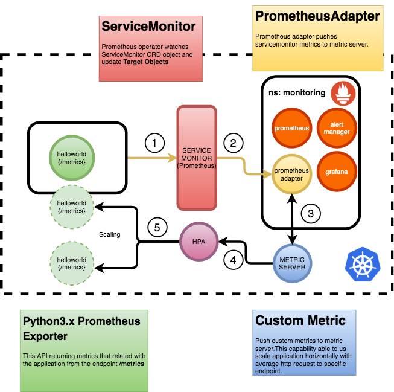
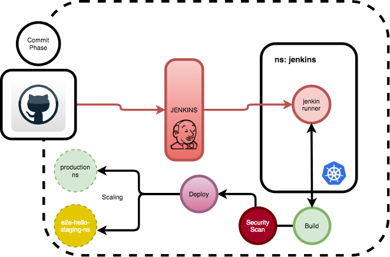

# e2e-hello CASE Documentation

This Project contains couple of major point shown below.

* Application
    * Codebase
    * Helm Chart

* Kubernetes Cluster (gcloud)
* Monitoring
    * Prometheus/Grafana
    * PrometheusAdapter/CustomMetrics
    * PrometheusExporter of application

* CI/CD Pipeline
    * * Jenkins
    * * Docker/Helm

# Application

## CodeBase
This is a simple python application you can see the codebase and Dockerfile under `application` directory.
You can build shown on docker environment.

```
    $ docker build .

```

Local:
```
    $ pip3 install -r requirements.txt
    $ python3 app.py
```

Application contains prometheus exporter and it returning `/metrics` endpoint successfully to gather metrics.`/hi` endpoint returins valid JSON response.


## HelmChart
HelmChart located on `application/hello-world` directory.You can update values under values.yaml file.

# KUBERNETES CLUSTER
I have setup a cluster on google-cloud for development purposes.
The command is shown as below:
```
    $ gcloud container clusters create MY_CLUSTER \
        --zone compute-zone

```

Notice: Metric-server already installed on GKE based clusters.If they don't I prefer to use this manifest file shown below:
NginxIngress able to us accept traffic easily:

```
    $ helm install --name nginx-ingress stable/nginx-ingress
```

# Monitoring
You can see general architectural diagram with explanation shown below.
I have used prometheusoperator with helm chart, it has couple of ability to access Dasboard and a lots of CRD options to easily automate and manage prometheus via simple manifest files.

</img>


In this project you can see the installation scripts under `./create_cluster/components.sh` directory.
By the I have added an example to get alert activity via webhook please check the directory autoscaler directory.It is a simple application that listen incoming payload from Alert Manager, to send the alerts via webhook you see the definition under cluster `operator.yaml` file.

`cluster-autoscaler-rules` containing application level alert defintion for prometheus and alertmanager, when you set up operator those definiton will appear on prometheus monitor.

# CI/CD Pipeline

I have used jenkins to build and deploy application.I set up `jenkins ` via helm chart, under the `jenkins` directory, it is has a installation script `setup_jenkins.sh`

Jobs are configured to poll changes from github.Jenkins configured to use `kubernetes` for run the `runner` agent to execute the jobs.

You can see the diagram below.
</img>
